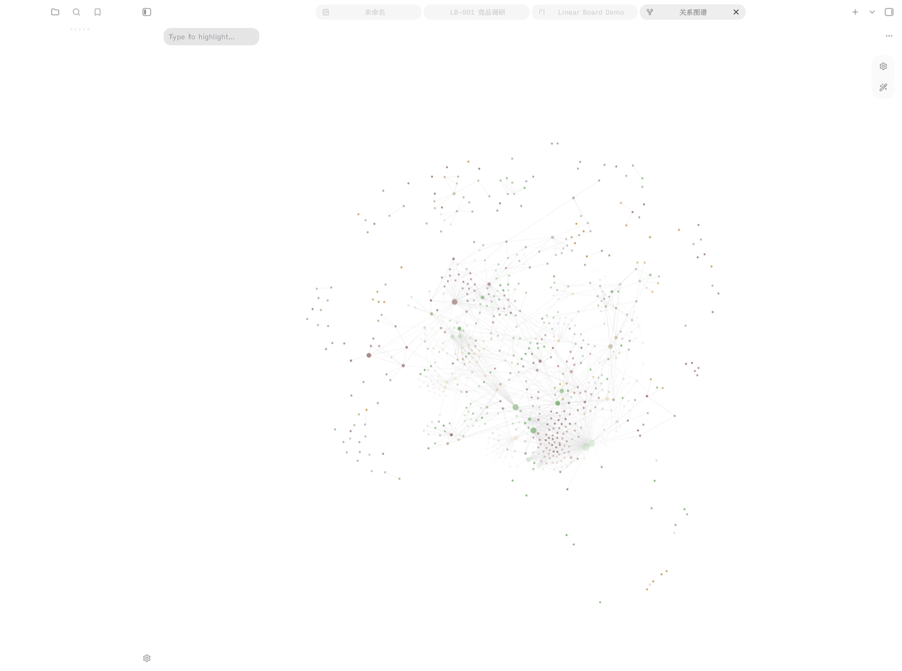

# Crisp Base

> Notion-like database views for [Obsidian](https://obsidian.md) Bases — board, calendar, timeline, relations and gallery, with an editable property inspector. Part of the Crisp plugin suite.



## 0.2.3

- 空日历现在仍显示完整月视图，可直接点击日期创建第一篇带日期的笔记。
- 看板、日历、时间线、关联、画廊及属性检查器的主要界面和视图设置完成中文化。

## Features

- **Board** — Linear-style kanban. Group notes by any property (status, priority, assignee…), drag cards between columns, define column order and always-visible columns.
- **Calendar** — month view driven by any date property, create notes on a day with the date pre-filled.
- **Timeline** — Gantt-style bars from start/end date properties, lanes grouped by any property, today marker, zoom levels.
- **Relations** — aggregate wikilinks and backlinks between the notes in a base; follow relations from chip to chip.
- **Gallery** — cover-image grid (cover property or embedded images) with property chips.
- **Inspector** — every view shares a right-side editable property panel (text / number / boolean / list), writing back to note frontmatter.
- **Filters, sort, formulas and summaries** come from the native Bases toolbar — Crisp Base is a rendering layer on top of Bases.

## Requirements

- Obsidian **1.10.2+** (Bases API)
- A **Crisp Suite / Crisp Base activation code** — unactivated, views run in read-only mode with a banner.

## Install

### BRAT

Add `https://github.com/letschips/crisp-base` to BRAT (Beta Reviewers Auto-update Tester) and install as a beta plugin.

### Manual

Download the latest `crisp-base-<version>.zip` from Releases, extract `main.js`, `manifest.json` and `styles.css` into `<vault>/.obsidian/plugins/crisp-base/`, then enable the plugin.

## Usage

1. Activate the plugin in **Settings → Crisp Base**.
2. Open (or create) a `.base` file — Bases is a core plugin.
3. In the view menu, switch the layout to **Crisp Base Board / Calendar / Timeline / Relations / Gallery**.
4. Configure per-view options in the view settings (grouping property, date properties, column order, …).

## Development

```bash
npm install
npm run dev      # watch build
npm run check    # tests + lint + type-check + build
npm run deploy -- "<obsidian-vault-path>"
npm run release  # build and zip runtime-only artifacts to ~/Desktop/crisp-base-release
```

## Architecture

- Views register through `Plugin.registerBasesView` (`app/`-style composition: `src/crisp-base-*-view.ts`).
- Data reads come from `BasesQueryResult` (`data`, `config`, `allProperties`); writes go through `fileManager.processFrontMatter`.
- The inspector is shared across views (`src/inspector.ts`).
- Styling is scoped CSS (`.lb-view` / `.cc-*`) — no Tailwind, no React.
- License verification reuses the Crisp suite Ed25519 + online device-check protocol (`src/license.ts`).

## Known limitations

- Not a relational database: relations are wikilink aggregations (`metadataCache.resolvedLinks`); backlink scans are O(n²) for large bases.
- No virtualization yet — boards cap cards per column (default 200, “+N more” raises it).
- Drag & drop is desktop-only; mobile uses the card menu.

## License

MIT © letschips
